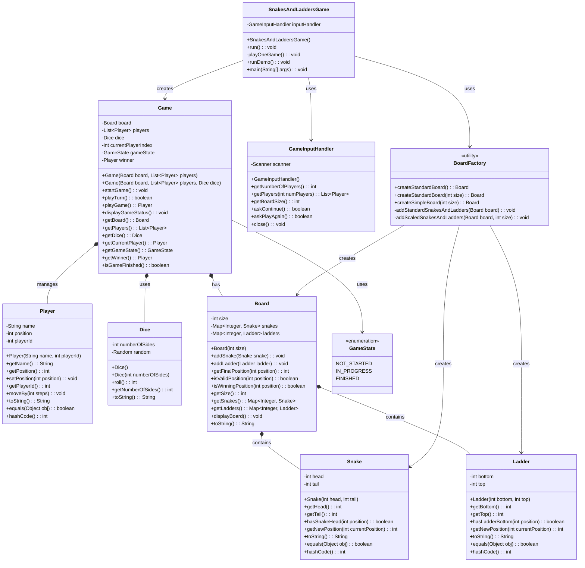

# Snakes and Ladders Game - Low Level Design Implementation

## Overview

This is a comprehensive implementation of the classic Snakes and Ladders board game, designed using Object-Oriented Programming principles and following SOLID design principles. The implementation showcases proper low-level design with clear separation of concerns, extensibility, and maintainability.

## Features

- **Interactive Gameplay**: Turn-based gameplay with user input
- **Configurable Board**: Support for different board sizes (10-100 squares)
- **Multiple Players**: Support for 2-6 players
- **Standard Configuration**: Classic 100-square board with traditional snakes and ladders
- **Flexible Design**: Easy to extend and modify game rules
- **Demo Mode**: Automated gameplay for demonstration
- **Input Validation**: Robust error handling and input validation
- **Clean UI**: Clear console-based user interface with game status display

## Class Diagram



## Architecture and Design Patterns

### 1. **Single Responsibility Principle (SRP)**
- Each class has a single, well-defined responsibility
- `Player` manages player state
- `Board` manages board configuration
- `Game` manages game logic and flow
- `GameInputHandler` handles user input
- `BoardFactory` creates board configurations

### 2. **Open/Closed Principle (OCP)**
- Easy to extend with new board configurations via `BoardFactory`
- Game rules can be extended without modifying existing classes
- New player types can be added by extending `Player`

### 3. **Dependency Inversion Principle (DIP)**
- `Game` depends on abstractions (`Board`, `Player`, `Dice`) rather than concrete implementations
- Easy to mock dependencies for testing

### 4. **Factory Pattern**
- `BoardFactory` encapsulates board creation logic
- Provides different board configurations (standard, simple, scaled)

### 5. **State Pattern (Implicit)**
- `GameState` enum manages game states
- Game behavior changes based on current state

## Package Structure

```
src/
├── com/snakesladders/
│   ├── model/                 # Core domain models
│   │   ├── Player.java
│   │   ├── Snake.java
│   │   ├── Ladder.java
│   │   ├── Dice.java
│   │   └── Board.java
│   ├── game/                  # Game engine and logic
│   │   ├── GameState.java
│   │   └── Game.java
│   ├── util/                  # Utility classes
│   │   ├── GameInputHandler.java
│   │   └── BoardFactory.java
│   └── SnakesAndLaddersGame.java  # Main application class
```

## How to Run

### Quick Start (Single Command)
```bash
# Compile and run in one go
javac src/com/snakesladders/model/*.java src/com/snakesladders/game/*.java src/com/snakesladders/util/*.java src/com/snakesladders/SnakesAndLaddersGame.java && java -cp src com.snakesladders.SnakesAndLaddersGame

# Demo mode  
javac src/com/snakesladders/model/*.java src/com/snakesladders/game/*.java src/com/snakesladders/util/*.java src/com/snakesladders/SnakesAndLaddersGame.java && java -cp src com.snakesladders.SnakesAndLaddersGame --demo
```

### Alternative: Separate Steps
```bash
# Step 1: Compile (first time only)
javac src/com/snakesladders/model/*.java src/com/snakesladders/game/*.java src/com/snakesladders/util/*.java src/com/snakesladders/SnakesAndLaddersGame.java

# Step 2: Run (anytime after compilation)  
java -cp src com.snakesladders.SnakesAndLaddersGame
```

## Game Rules

1. **Objective**: Be the first player to reach the final square (typically square 100)
2. **Setup**: Players start at position 0 (outside the board)
3. **Turns**: Players take turns rolling a dice and moving forward
4. **Snakes**: Landing on a snake's head moves you down to its tail
5. **Ladders**: Landing on a ladder's bottom moves you up to its top
6. **Winning**: First player to reach the final square wins
7. **Overflow**: If a dice roll would take you beyond the final square, you don't move (optional rule)

## Key Design Decisions

### 1. **Immutable Snake and Ladder Objects**
- Snake and Ladder positions are final once created
- Ensures board integrity throughout the game

### 2. **Encapsulated Game State**
- Game state is managed internally by the `Game` class
- External classes cannot directly modify game state

### 3. **Flexible Board Size**
- Board size is configurable (10-100 squares)
- Snake and ladder positions scale automatically

### 4. **Robust Input Validation**
- All user inputs are validated
- Graceful error handling and user feedback

### 5. **Separation of Concerns**
- UI logic separated from game logic
- Board creation logic separated from game logic
- Input handling separated from game flow

## Extension Points

### 1. **Custom Board Configurations**
```java
// Add new board factory methods
public static Board createCustomBoard(int size, List<Snake> snakes, List<Ladder> ladders) {
    // Custom implementation
}
```

### 2. **Different Dice Types**
```java
// Create specialized dice
Dice customDice = new Dice(8); // 8-sided dice
Game game = new Game(board, players, customDice);
```

### 3. **Special Player Types**
```java
// Extend Player class for special abilities
public class LuckyPlayer extends Player {
    // Special player with bonus moves
}
```

### 4. **Game Variants**
```java
// Extend Game class for different rules
public class SpeedGame extends Game {
    // Faster-paced variant
}
```

## Testing Strategy

The implementation is designed for easy testing:

1. **Unit Tests**: Each class can be tested independently
2. **Integration Tests**: Game flow can be tested with mock objects
3. **Boundary Tests**: Board boundaries and edge cases are handled
4. **State Tests**: Game state transitions are well-defined

## Future Enhancements

1. **GUI Implementation**: Replace console UI with graphical interface
2. **Network Play**: Add multiplayer support over network
3. **Save/Load Game**: Persist game state to file
4. **Statistics**: Track player statistics and game history
5. **Custom Rules**: Configuration file for custom game rules
6. **AI Players**: Computer-controlled players with different strategies
7. **Sound Effects**: Audio feedback for game events
8. **Animations**: Visual animations for player movements

## Conclusion

This Snakes and Ladders implementation demonstrates solid object-oriented design principles, clean architecture, and extensible code structure. The design emphasizes maintainability, testability, and the ability to easily add new features while keeping the core game logic intact.

The implementation serves as an excellent example of low-level design in software engineering, showcasing how to break down a simple game into well-structured, cohesive classes with clear responsibilities and relationships.
